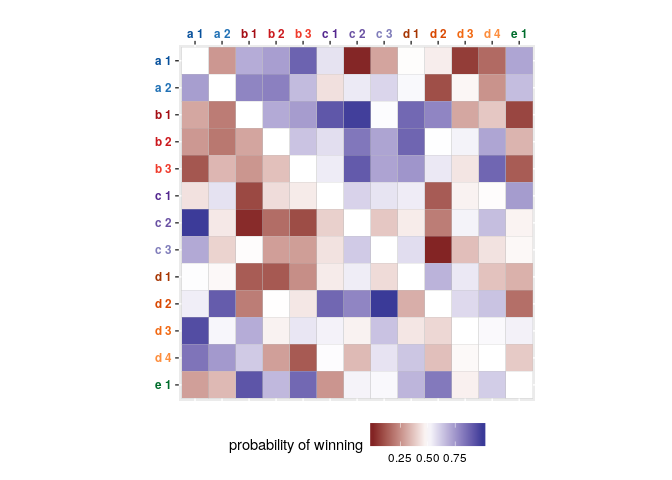
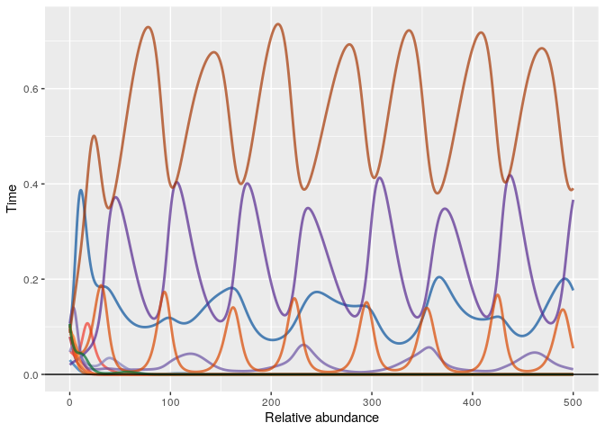
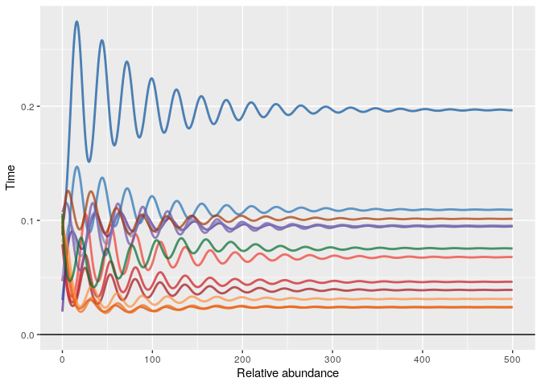
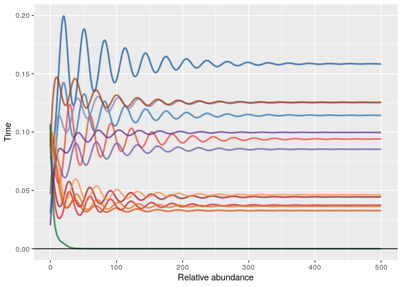

<style>
body{
  font-family: 'Oxygen', sans-serif;
  font-size: 16px;
  line-height: 24px;
}

h1,h2,h3,h4 {
  font-family: 'Raleway', sans-serif;
}

.container { width: 1000px; }
h3 {
  background-color: #D4DAEC;
  text-indent: 100px; 
}
h4 {
  text-indent: 100px;
}

g-table-intro h4 {
  text-indent: 0px;
}
</style>

Daniel S. Maynard, Carlos A. Serván, José A. Capitán, Stefano Allesina

*Ecology Letters*, In press

### Overview

In this example, we use the zero-sum replicator equation as the base model, demonstrating how phenotypic variation stabilizes the dynamics and insulates the communities against demographic perturbations. Please see the file `Lotka_Volterra_dynamics.R` in the `code` folder for the corresponding generalized Lotka Volterra simulations.

### Package requirements

To run this code, please install and load the following packages:

```r
library(ggplot2) # for plotting
library(scales) # for plotting
library(reshape) # matrix -> edge list
library(dplyr) # data wrangling
library(RColorBrewer) # choice of colors
library(igraph) # plot graphs
library(deSolve) # integrate ODEs
```

### Building a competitive network 

In this section, we are going to build a community composed of 5 species, each displaying a certain number of phenotypes. First of all, we set a seed for the random number generator, to ensure reproducibility. Changing this seed will produce a different competitive community.


```r
set.seed(18)
```

Then, we can load the functions for building the competitive network:

```r
source("../code/network_construction.R")
```

As described in the manuscript, to parameterize our system, we have to choose:

- the number of species and phenotypes, which we encode in the vector `m`, containing the number of phenotypes for each species;
- a value for $\tau$, controlling the similarity among the phenotypes within each species;
- a value for $p$, controlling phenotypic memory.


```r
m <- c(2, 3, 3, 4, 1) # five species, with different number of phenotypes
tau <- 0.5 # high correlation among phenotypes of the same species
p <- 1.0 # for now, keep perfect phenotypic memory
```

The system is defined by two matrices: $H$, expressing the competitive abilities of each phenotype, and $Q$, reporting the probability that a phenotype $i$ give rise to phenotype $j$ when reproducing. To build matrix $H$, we need to pass the vector `m` as well as the value of $\tau$:


```r
H <- construct_matrix_H(m, tau)
```

To visualize the matrix $H$, load the plotting functions:

```r
source("../code/plotting.R")
plot_matrix_H(m, H)
```

<!-- -->

Where each letter (and color) refers to a species, and the index to the phenotype within each species. 

Because we set `p <- 1` (perfect phenotypic memory), the matrix $Q$ is simply the identity matrix:

```r
Q <- construct_matrix_Q(m, p)
plot_matrix_Q(m, Q)
```

<!-- -->

The system can also be visualized as a weighted, directed graph:

```r
plot_competition_graph_phenotypes(m, H)
```

<!-- -->
  
where an edge connects the dominant phenotype to the loser, and the edge weight stands for the probability of winning.

### Dynamics

Having set up the community, we can choose initial conditions and integrate the dynamics:

```r
n_pheno <- sum(m) # total number of phenotypes
x0 <- runif(n_pheno) # random initial conditions
x0 <- x0 / sum(x0) # put on the simplex
source("../code/Replicator_dynamics.R") # functions to integrate numerically
dynamics <- integrate_dynamics(x0 = x0, pars = list(H = H, Q = Q))
plot_dynamics(dynamics, m) # plot time evolution of the relative abundance of each phenotype
```

<!-- -->

In the case of perfect phenotypic memory, each phenotype behaves as a separate species (the different phenotypes belonging to the same species are not coupled by reproduction). As such, the dynamical equation simplifies to the replicator dynamics studied by [Allesina & Levine (PNAS, 2011)](http://www.pnas.org/content/108/14/5638) and [Grilli *et al.* (Nature, 2017)](https://www.nature.com/articles/nature23273): some of the phenotypes rapidly go extinct (irrespective of initial conditions), while the others cycle neutrally around an equilibrium point, with the amplitude of cycles determined by the initial conditions.

### Imperfect phenotypic memory

We now turn to the main result in the manuscript: when phenotypes are connected through reproduction by imperfect phenotypic memory, coexistence is enhanced, and the dynamics are stable.

We keep the same competitive network and initial conditions, but change phenotypic memory to couple the phenotypes:


```r
p <- 0.85
Q <- construct_matrix_Q(m, p)
plot_matrix_Q(m, Q)
```

<!-- -->

Integrating the dynamics, we see that now a) all species (and phenotypes) coexist, and b) dynamics are stable:


```r
dynamics <- integrate_dynamics(x0 = x0, pars = list(H = H, Q = Q))
plot_dynamics(dynamics, m)
```

<!-- -->

### Demographic variation

To incorporate demographic variation into the model, we need to specify an additional vector of death ($d$) and fecundity ($f$) rates, here selected from a uniform $\mathcal{U}(0.90,1.10)$ distribution, allowing for $\pm 10$% variation in demographic rates:


```r
f <- runif(n_pheno, 0.9,1.1)
d <- runif(n_pheno, 0.9,1.1)

ggplot(data.frame(f=f,d=d, Species = factor(rep(1:length(m),m))),
	   aes(x=d, y=f, color = Species))+
	   geom_point(size=3)+xlab("Death rate")+ylab("Fecundity rate")+
	   scale_color_manual(values=choose_phenotype_colors(rep(1:length(m),m), length(m))$sppdarkcolors)
```

<!-- -->

First, we can explore the dynamics of the system where phenotypic variation is absent. To do this, we uncouple the phenotypes by setting $Q$ equal to the identity matrix, which allows each phenotype to behave as its own \textit{de facto} species, and we add the demographic vectors $f$ and $d$ to the list of parameters. Doing so causes the system to fluctuate wildly, ultimately collapsing to a single species:


```r
dynamics_uncoupled <-
	integrate_dynamics(x0 = x0, pars = list(H = H, Q = diag(n_pheno), f=f, d=d), int_time=1e5, int_steps=1e3)
plot_dynamics(dynamics_uncoupled, m)
```

<!-- -->

Thus, in the absence of phenotypic variation, perturbation of species' demographic rates inevitably leads to coexistence of a single species (and in fact, a single phenotype). Now, to explore the effects of phenotypic variation, we link the phenotypes back together by using the original reproduction matrix $Q$:


```r
dynamics_dem_var <- integrate_dynamics(x0 = x0, pars = list(H = H, Q = Q, f=f, d=d))
plot_dynamics(dynamics_dem_var, m)
```

<!-- -->

By adding demographic variation, the diversity of the system declines slightly, with one species (green) going extinct due to its relatively high death rate. Yet the system now exhibits stable dynamics, with the equilibrium abundances slightly perturbed from their previous levels due to the fact that each phenotype has a modified fitness. 


Phenotypic variation therefore not only stabilizes the dynamics, but it buffers the community against structural perturbations, leading to significant increases in diversity.


